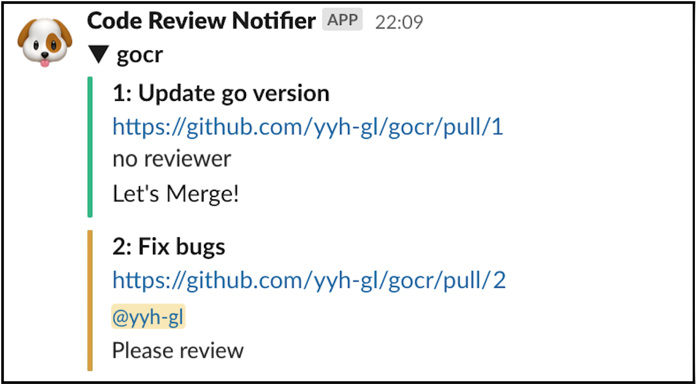

# GoCR

GoCR provides easy way for notifying request of code review.

You will soon be able to start a notification of code review request.

## Supported tools

- Code Management services
  - GitHub
- Message Services
  - Slack 

## Introduction

1. `$ go get -u github.com/yyh-gl/gocr`
1. Set repositories and notification destinations into `~/.gocr.yml`.  
Example `.gocr.yml` is [here](https://github.com/yyh-gl/gocr/blob/master/.gocr.example.yml).
1. `$ gocr`

### Path setting of config file

GoCR load `.gocr.yml` from root directory by default.

You can decide a path to config file by using `cfgPath`（`-c`） option.

`$ gocr -c /path/to/.goct.yml`
